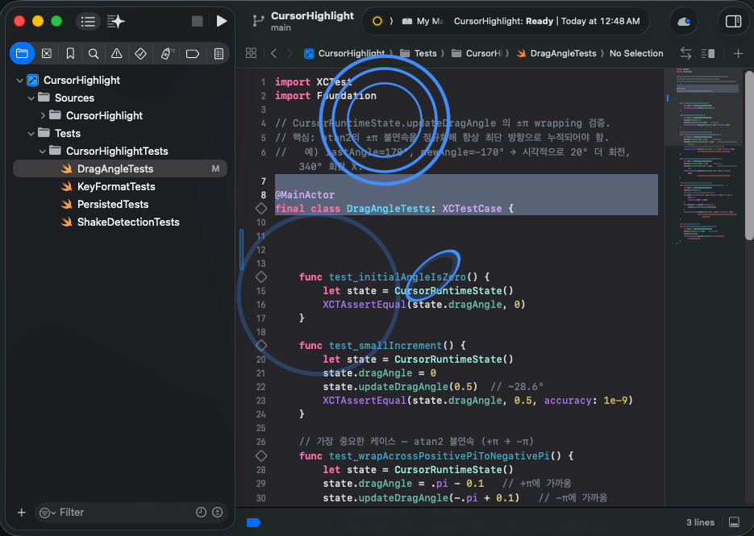

# CursorHighlight

macOS menu bar app. Visually emphasizes the mouse cursor for screen recording, presentations, and pair programming.

> 🇰🇷 [한국어 README](README.md)



## Features

- **Cursor Ring** — colored ring around the cursor (circle/squircle/rhombus, 4 sizes, glow, breathing animation)
- **Click Effects** — left (circular ripple), right (rhombus double ripple), double-click (burst), middle/wheel (rotating arcs)
- **Drag Indicator** — ring stretches in drag direction
- **Scroll Indicator** — directional arrows (↑↓←→) with magnitude-proportional size (precise scroll vs page scroll distinguished at a glance)
- **Cursor Trail** — afterglow comet tail
- **Magnifier** — real-time 1.5×–4× zoom around cursor
- **Spotlight** — dim everything except a circle around the cursor
- **Keystroke Display** — show pressed shortcuts as bottom overlay. Optional auto-enable when an unknown external monitor (meeting room, etc.) connects (trusted monitors excluded)
- **Shake Detection** — wave the mouse to flash SOS ring at the cursor
- **Screenshot Mode** — menu bar toggle. Normally overlay window has `sharingType = .none` (so the magnifier doesn't re-capture itself), but you can flip it to `.readOnly` temporarily for external `screencapture`/OBS. Auto-OFF on app restart.

## Shortcuts

All shortcuts use `⌃⌥` (Control + Option):

| Key | Action |
|---|------|
| `⌃⌥S` | Toggle spotlight |
| `⌃⌥M` | Toggle magnifier |
| `⌃⌥=` | Magnifier zoom in (0.5× step, max 4.0×) |
| `⌃⌥-` | Magnifier zoom out (min 1.5×) |
| `⌃⌥K` | Toggle keystroke display |
| `⌃⌥1` | Yellow ring |
| `⌃⌥2` | Red ring |
| `⌃⌥3` | Blue ring |
| `⌃⌥4` | Green ring |
| `⌃⌥5` | Cyan ring |
| `⌃⌥6` | Purple ring |
| `⌃⌥0` | Cycle to next ring color (quick change during presentation) |

Some shortcuts are configurable in Preferences (menu bar → Preferences).

## System Requirements

- macOS 13.0 or later
- Apple Silicon (current build; Universal build required for Intel)

## Installation

### Homebrew (recommended)

```bash
brew install --cask kykim79/tap/cursorhighlight
```

Homebrew automatically removes the quarantine flag, so no Gatekeeper bypass needed. Updates: `brew upgrade --cask cursorhighlight`.

### Manual

Download `CursorHighlight.zip` from [Releases](https://github.com/kykim79/CursorHighlight/releases):

1. Unzip → move `CursorHighlight.app` to `/Applications`
2. **First launch**: right-click in Finder → Open → confirm "Open" (Gatekeeper bypass, once)

If right-click → Open doesn't work:
```bash
xattr -dr com.apple.quarantine /Applications/CursorHighlight.app
```

### Permissions (required regardless of install method)

System Settings → Privacy & Security:
- **Accessibility** (required): mouse/keyboard event capture
- **Input Monitoring** (required): shortcut detection
- **Screen Recording** (optional): for magnifier feature

After granting, restart the app → `cursorarrow.rays` icon appears in menu bar.

## Localization

The app UI supports **Korean** and **English** based on macOS system language. To switch:

System Settings → General → Language & Region → reorder preferred languages.

## License

Personal project.
