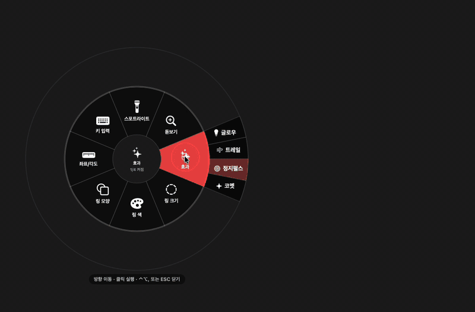
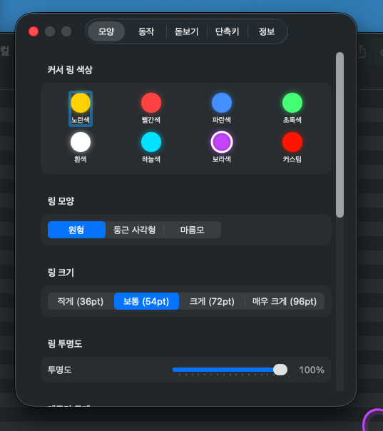

# Cluxo

[](LICENSE)
[](https://github.com/kykim79/Cluxo/releases/latest)
[](https://github.com/kykim79/Cluxo)
[](https://swift.org)
[](https://github.com/kykim79/Cluxo/releases)
[](https://github.com/kykim79/Cluxo/stargazers)

macOS 메뉴바 앱. 마우스 커서를 시각적으로 강조해 화면 녹화, 발표, 페어 프로그래밍 시 커서 위치를 명확하게 보여줍니다. 그리기 도구·라디얼 메뉴·키스트로크 표시 등 발표/스크린캐스트 워크플로우를 위한 종합 도우미.

> 🇺🇸 [English README](README.en.md)



## 기능

- **커서 링** — 마우스 주위에 색상 링 표시 (원형/둥근 사각형/마름모, 4단계 크기, 글로우, 호흡 애니메이션)
- **클릭 효과** — 좌클릭(원형 파동), 우클릭(마름모 2중 파동), 더블클릭(버스트), 휠 클릭(회전 호)
- **드래그 인디케이터** — 드래그 시 링이 방향대로 늘어남
- **스크롤 인디케이터** — 스크롤 방향 화살표 (↑↓←→) 표시 + 진폭 비례 크기 (정밀 스크롤과 큰 page 스크롤 한눈에 구분)
- **커서 트레일** — 잔상 효과 (글로우 코멧 테일)
- **돋보기** — 커서 주변 화면 1.5×–4× 실시간 확대
- **스포트라이트** — 커서 주변만 밝게, 나머지 어둡게
- **키스트로크 표시** — 누른 단축키를 화면 하단에 오버레이. 낯선 외장 모니터(회의실 등) 연결 시 자동 활성화 옵션 (신뢰 모니터는 제외)
- **흔들기 감지** — 마우스 흔들면 SOS 링으로 위치 알림
- **스크린샷 모드** — 메뉴바 토글. 평소엔 자체 돋보기가 자기 overlay를 재캡처하지 않게 외부 캡처에서 제외되지만, 발표 자료/데모 GIF 만들 땐 이 토글로 외부 `screencapture`/OBS에 잡히게 풀어줌. 앱 재시작 시 자동 OFF.
- **라디얼 메뉴 (⌃⌥, 또는 길게 누름)** — 마우스 커서 위치에 8 sector 메뉴. 효과 토글·색·크기·모양·돋보기·스포트라이트를 메뉴 유지 상태로 연속 조정 가능 (발표 중 빠른 다중 변경). 현재 활성 설정은 옅은 액센트 배경으로 표시.
  - **단축키 외에도 마우스 좌클릭 길게 누름(0.5초) 또는 트랙패드 길게 누름으로 열립니다** — 트랙패드만 쓰는 노트북·키보드 손 떼기 어려운 상황에 유용. 5pt 이내 deadband로 일반 드래그·클릭과 충돌 없음.
- **그리기 모드 (⌃⌥D)** — 발표·스크린캐스트용 화면 annotation. 7종 도구: 자유 펜·직선(Shift)·화살표(Opt)·사각형(Cmd)·타원(Cmd+Shift)·형광펜(Cmd+Opt)·번호 뱃지(Shift+Opt 클릭). 모드 활성 중 Cmd+Z로 마지막 도형 제거, `[`/`]`로 두께 5단계 조절. 색은 링 색을 따름.
- **트랙패드 제스처 시각 피드백 (실험적)** — 4손가락 핀치 인/아웃, 3·4손가락 4방향 스와이프, 5손가락 핀치 등 시스템 제스처에 라벨/효과 표시. 발표 중 손동작을 청중에게 보여줄 때 유용. 비공식 MultitouchSupport API 의존이라 환경설정에서 기본 OFF — "동작" 탭에서 켜세요.

## 단축키

모든 단축키는 `⌃⌥` (Control + Option) 조합:

| 키 | 동작 |
|---|------|
| `⌃⌥S` | 스포트라이트 켜기/끄기 |
| `⌃⌥M` | 돋보기 켜기/끄기 |
| `⌃⌥=` | 돋보기 줌 in (0.5x step, max 4.0x) |
| `⌃⌥-` | 돋보기 줌 out (min 1.5x) |
| `⌃⌥K` | 키스트로크 표시 켜기/끄기 |
| `⌃⌥1` | 노란색 링 |
| `⌃⌥2` | 빨간색 링 |
| `⌃⌥3` | 파란색 링 |
| `⌃⌥4` | 초록색 링 |
| `⌃⌥5` | 하늘색 링 |
| `⌃⌥6` | 보라색 링 |
| `⌃⌥7` | 흰색 링 |
| `⌃⌥C` | 다음 링 색상으로 순환 (Color cycle) |
| `⌃⌥H` | 다음 링 모양으로 순환 (sHape cycle — 원형 ↔ 둥근 사각형 ↔ 마름모) |
| `⌃⌥I` | 인스펙터 — 커서 옆 (x, y) 시스템 좌표 표시 |
| `⌃⌥,` | **라디얼 메뉴** — 8 sector 마우스 메뉴. 클릭으로 효과/색/크기/모양/돋보기/스포트라이트 즉시 토글, 메뉴 유지로 연속 조정 가능. ESC로 닫기. **마우스 좌클릭 길게 누름(0.5초) 또는 트랙패드 길게 누름**으로도 동일하게 열림 |
| `⌃⌥D` | **그리기 모드 토글** — 화면 annotation. 모드 활성 중 드래그=펜 / **Shift**+드래그=직선 / **Opt**+드래그=화살표 / **Cmd**+드래그=사각형 / **Cmd+Shift**+드래그=타원 / **Cmd+Opt**+드래그=형광펜 / **Shift+Opt**+클릭=번호 뱃지. 모드 활성 중 **Cmd+Z**=마지막 도형 제거, **`[`** / **`]`**=두께 조절, **ESC**=clear+종료. 색은 현재 링 색을 따름 |

환경설정에서 일부 단축키는 변경 가능 (메뉴바 아이콘 → 환경설정).

## 환경설정

색상 8슬롯 (커스텀 포함), 모양 3종, 크기 4단계, 투명도/속도/효과 토글까지 한 곳에서 조정. UI 언어는 "정보" 탭에서 시스템 기본 / 한국어 / English 선택.




## 시스템 요구사항

- macOS 13.0 이상
- Apple Silicon (현재 빌드 기준; Intel은 Universal 빌드 필요)

## 사용자 설치

### Homebrew (추천)

```bash
brew install --cask kykim79/tap/cluxo
```

Homebrew가 다운로드 시 quarantine flag를 자동으로 제거해주므로 Gatekeeper 우회 절차 없이 바로 동작. 업데이트도 `brew upgrade --cask cluxo` 한 줄.

### 수동 설치

[Releases](https://github.com/kykim79/Cluxo/releases)에서 `Cluxo.zip` 다운로드 후:

1. 압축 해제 → `Cluxo.app`을 `/Applications`로 이동
2. **첫 실행**: Finder에서 우클릭 → 열기 → "열기" 확인 (Gatekeeper 우회, 한 번만)

우클릭→열기도 안 되면:
```bash
xattr -dr com.apple.quarantine /Applications/Cluxo.app
```

### 권한 부여 (설치 방식과 무관 — 공통)

시스템 설정 → 개인정보 보호 및 보안에서:
- **손쉬운 사용** (필수): 마우스/키보드 이벤트 캡처
- **입력 모니터링** (필수): 단축키 감지
- **화면 녹화** (선택): 돋보기 사용 시

권한 부여 후 앱 재시작 → 메뉴바에 `cursorarrow.rays` 아이콘 표시되면 정상.

## 개발 환경 구축

다른 Mac에서 처음 받았을 때:

```bash
# 사전 도구 설치
brew install xcodegen

# 클론
gh repo clone kykim79/Cluxo
cd Cluxo

# .xcodeproj 생성 (git에는 없음, project.yml에서 재생성)
xcodegen

# Xcode 열기
open Cluxo.xcodeproj
```

### SourceKit-LSP 인식 (VS Code/Cursor 등 외부 에디터 사용 시)

Xcode 외부 에디터에서 SourceKit-LSP가 모듈을 정확히 인식하게 하려면 build server 설정:

```bash
brew install xcode-build-server
xcode-build-server config -project Cluxo.xcodeproj -scheme Cluxo
```

→ `buildServer.json` 생성 (gitignore됨, user-specific path 포함). 한 번 실행하면 이후 LSP가 cross-file 타입을 정확히 인식.

이후 Xcode에서 `⌘R`로 빌드/실행 가능.

### CLI 빌드 + 설치

```bash
# Release 빌드
xcodebuild -project Cluxo.xcodeproj \
  -scheme Cluxo \
  -configuration Release \
  build

# /Applications에 설치
pkill -x Cluxo 2>/dev/null
rm -rf /Applications/Cluxo.app
cp -R "$HOME/Library/Developer/Xcode/DerivedData/Cluxo-"*"/Build/Products/Release/Cluxo.app" /Applications/
open /Applications/Cluxo.app
```

### 권한 초기화 (재배포 시 깨끗하게 시작)

```bash
tccutil reset Accessibility com.ktoy.Cluxo
tccutil reset ScreenCapture com.ktoy.Cluxo
tccutil reset ListenEvent com.ktoy.Cluxo
tccutil reset PostEvent com.ktoy.Cluxo
```

## 프로젝트 구조

```
Cluxo/
├── project.yml                          # XcodeGen 설정 (소스 of truth)
├── Sources/Cluxo/
│   ├── main.swift                       # 앱 진입점
│   ├── AppDelegate.swift                # 메뉴바 + 서비스 oikkeo·이벤트 라우팅
│   │
│   │   # State (CursorState God Object 분할)
│   ├── CursorSettings.swift             # @Persisted 영구 설정 + enums
│   ├── CursorRuntimeState.swift         # cursor 위치·motion·드래그
│   ├── EffectsState.swift               # 효과 큐 (클릭/스크롤/트레일/흔들기)
│   ├── KeystrokeOverlayState.swift      # 키스트로크 알림 큐
│   ├── Persisted.swift                  # @Persisted PropertyWrapper (UserDefaults bridging)
│   ├── ShakeState.swift                 # 흔들기 감지 알고리즘 (각 축 독립)
│   │
│   │   # Services (AppDelegate God Object 분할)
│   ├── PermissionsManager.swift         # Accessibility·ScreenRecord·ListenEvent 권한
│   ├── AppActivationDetector.swift      # 발표·녹화·회의 앱 활성화 감지 (NSWorkspace)
│   ├── MagnifierCaptureService.swift    # 돋보기 ScreenCaptureKit (SCStream)
│   ├── KeyboardHotkeyHandler.swift      # 전역 단축키 + 키스트로크 표시
│   ├── MouseEventMonitor.swift          # CGEventTap (백그라운드 스레드)
│   │
│   │   # Views
│   ├── OverlayWindowController.swift    # 전체화면 투명 오버레이 NSWindow
│   ├── OverlayContentView.swift         # SwiftUI 뷰 (링·효과·트레일·앵커라인·컴맷테일)
│   ├── PreferencesView.swift            # 환경설정 윈도우
│   │
│   ├── Info.plist                       # LSUIElement, 권한 설명
│   ├── Cluxo.entitlements
│   └── Assets.xcassets/AppIcon.appiconset/
├── Tests/CluxoTests/          # 단위 테스트 38개 (standalone bundle)
├── .github/workflows/release.yml        # tag push → 빌드 + zip + Release + tap 갱신
├── docs/screenshots/                    # README 이미지
├── CHANGELOG.md
└── README.md
```

`.xcodeproj`는 `xcodegen`이 매번 생성하므로 git ignore. `project.yml`이 진짜 프로젝트 정의.

## 아키텍처 노트

- **LSUIElement = true**: Dock 아이콘 없는 메뉴바 전용 앱
- **CGEventTap (백그라운드 스레드)**: 메인 RunLoop와 격리되어 NSMenu 트래킹, 앱 활성화 변화에 영향받지 않음
- **이벤트 기반 커서 추적**: 폴링 Timer 없음. `onMouseMove`로 push, idle 감지는 `DispatchWorkItem`
- **좌표계 변환**: CGEvent의 Quartz 좌표(top-left)를 Cocoa 좌표(bottom-left)로 변환 후 `cursorPosition` 저장
- **멀티 모니터**: 각 `NSScreen`마다 별도 오버레이 윈도우. `screenFrame.contains(point)` 필터로 같은 효과가 다른 화면에 중복 렌더링 안 됨
- **돋보기 캡처**: ScreenCaptureKit `SCStream` 20Hz push, CIImage cropping. cursor가 다른 디스플레이로 옮기면 stream을 그 디스플레이로 자동 재구성
- **Overlay sharingType**: 평소 `.none`이라야 자체 돋보기가 자기 overlay를 다시 capture 안 함. 메뉴바 "스크린샷 모드" ON 시 `.readOnly`로 일시 풀어 외부 screencapture/OBS가 잡게 함 (앱 재시작 시 자동 OFF)

## 라이선스

MIT License — 자세한 내용은 [LICENSE](LICENSE) 파일 참조.

Copyright (c) 2026 kykim79
